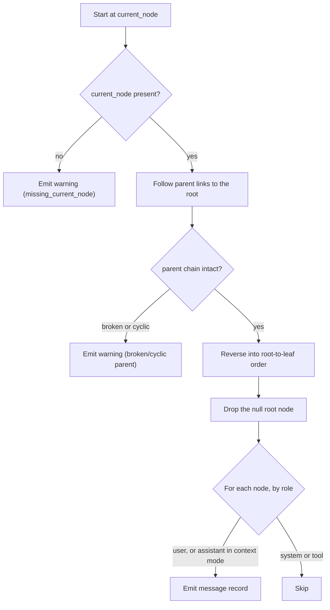

# Compact Preprocessor Output Format

This document defines the output contract for the optional deterministic
ChatGPT export preprocessor described in
[`docs/issues/004-add-deterministic-export-preprocessor.md`](issues/004-add-deterministic-export-preprocessor.md).

The preprocessor reduces a ChatGPT export to the smallest set of records a
Footprints report needs: the user-authored messages on each conversation's
active path, in graph order, plus a clear record of anything that could not be
processed. Reducing the export is optional. Direct JSON analysis remains the
default Footprints workflow; this format exists so larger exports can be reduced
deterministically before reflection, and so tests have a stable target.

This document owns the output contract only. It does not implement the
preprocessor (issue 004), define parser fixtures (issue 005), or provide the
automated extraction tests (issue 006).

## Goals

- Compact enough for large exports: one small JSON object per line.
- Explicit enough to preserve traceability, chronology, source files, roles,
  and attachment metadata.
- Local-first: a consumer never needs the network to read this format.
- Deterministic: the same input always produces the same output, byte for byte.
- Self-contained per line: each record carries the conversation context it needs,
  so a reader can process the stream one line at a time.

## Encoding

- Output is **JSONL** (also called NDJSON): exactly one JSON object per line.
- Files use UTF-8 with no byte-order mark.
- Lines are separated by a single `\n`. The final line ends with `\n`.
- Every line is a complete, independently valid JSON object. No line spans two
  physical lines; newlines inside extracted text are escaped as `\n` per JSON.
- Numbers use plain JSON numbers. Timestamps are Unix epoch **seconds** and may
  be fractional, matching the source export.
- Field names use `snake_case`.

A recommended file name is `footprints-export.jsonl`, but the consumer chooses
the path.

## Record Types

Every line has a `type` field that selects one of two record shapes:

| `type`    | Purpose                                                              |
| --------- | ------------------------------------------------------------------- |
| `message` | One substantive message on a conversation's active path (evidence). |
| `warning` | One operational problem found while reading the export.             |

These two types let a consumer cleanly separate user evidence, optional
assistant context, and operational warnings:

- user evidence — `type: "message"`, `role: "user"`;
- assistant context — `type: "message"`, `role: "assistant"` (assistant-context
  mode only, see below);
- operational warnings — `type: "warning"`.

System and tool messages are never emitted as `message` records.

## Message Record

A `message` record is one node on a conversation's reconstructed active path
(start at `current_node`, follow `parent` to the root, reverse, drop the null
root node). Inactive branches are never emitted.



The same traversal underlies every `message` record; a reconstruction failure
produces a `warning` record instead, so a consumer is never silently missing a
conversation.

### Required fields

| Field               | Type    | Description                                                                                  |
| ------------------- | ------- | -------------------------------------------------------------------------------------------- |
| `type`              | string  | Always `"message"`.                                                                          |
| `source_file`       | string  | Name of the export file this message came from, e.g. `"chat.json"`.                          |
| `conversation_id`   | string  | The conversation's `conversation_id` (or `id` when `conversation_id` is absent).             |
| `conversation_title`| string  | The conversation title. Empty string `""` when the source title is missing or null.          |
| `active_path_index` | integer | 0-based position of this message within the reconstructed active path. The authoritative order. |
| `message_id`        | string  | The message node's `id`.                                                                     |
| `role`              | string  | `"user"` or `"assistant"`. System and tool roles are excluded.                               |
| `content_type`      | string  | The source `content.content_type`, e.g. `"text"` or `"multimodal_text"`.                     |
| `text`              | string  | Extracted text (see Text extraction). Empty string `""` when the message has no text parts.  |
| `attachments`       | array   | Array of attachment objects. Empty array `[]` when there are none.                           |

`active_path_index` exists so consumers order messages by graph position, never
by timestamp. The source export contains generated assistant and tool sequences
whose timestamps do not follow graph order, so timestamps must not be used for
ordering.

### Optional fields

| Field                      | Type           | Description                                                                 |
| -------------------------- | -------------- | --------------------------------------------------------------------------- |
| `parent_id`                | string         | The node's `parent` id. Include when useful for traceability.               |
| `message_create_time`      | number \| null | The message `create_time` in Unix seconds. `null` or omitted when absent.   |
| `conversation_create_time` | number \| null | The conversation `create_time` in Unix seconds.                             |
| `conversation_update_time` | number \| null | The conversation `update_time` in Unix seconds.                             |

A consumer must tolerate an optional field being absent or `null`; the two are
equivalent.

### Attachment object

Each element of `attachments` describes one attachment referenced by the
message's `metadata.attachments[]`.

| Field       | Type           | Required | Description                                          |
| ----------- | -------------- | -------- | ---------------------------------------------------- |
| `name`      | string         | yes      | The attachment file name.                            |
| `mime_type` | string \| null | no       | The MIME type when present, e.g. `"image/png"`.      |
| `id`        | string         | no       | The export's file id, when present.                  |
| `size`      | integer        | no       | Size in bytes, when present.                         |
| `width`     | integer        | no       | Image width in pixels, when present.                 |
| `height`    | integer        | no       | Image height in pixels, when present.                |

**Attachment metadata is not evidence of attachment contents.** These fields
record that a file was referenced, not what the file contained. The contents are
only available when the corresponding exported file is also present, which this
format does not assume.

## Roles and Assistant-Context Mode

The preprocessor has two output modes:

- **Default (user-first):** only `role: "user"` message records are emitted.
  This is the primary evidence for a Footprints report.
- **Assistant-context mode:** assistant messages on the active path are also
  emitted as `role: "assistant"` message records, interleaved with the user
  records by `active_path_index`. This mode is opt-in and explicit.

In both modes, system and tool messages are excluded from message records. The
only difference between the modes is whether `role: "assistant"` records appear.
A consumer can therefore read a single stream and keep or drop assistant context
by filtering on `role`.

## Text Extraction

`text` is the concatenation of the **string** values in `message.content.parts`,
in order. For `multimodal_text`, `parts` mixes plain strings with
image-reference objects (objects carrying an `asset_pointer`); the image-reference
objects are **not** text and are excluded from `text`. See
[`docs/chatgpt-export-schema.md`](chatgpt-export-schema.md) for the source
content variants.

When a message has no string parts, `text` is the empty string `""`. The
`content_type` still reflects the source so a consumer can tell an empty text
message from an empty extraction.

## Determinism and Ordering

For a given input, output is byte-for-byte reproducible. Records appear in this
order:

1. By **source file**, in input order. A directory of numbered
   `conversations-*.json` files is read in ascending numeric order.
2. Within a file, by **conversation**, in the order conversations first appear.
3. Within a conversation, message records appear in ascending
   `active_path_index`.

A warning that concerns a specific conversation appears immediately after that
conversation's message records (or in place of them, when the conversation could
not be reconstructed). A warning that concerns a whole file (for example a parse
failure or a missing chunk) appears in that file's position in the stream.

## Deduplication

When numbered export chunks overlap, a conversation that appears in more than one
file is emitted **once**: the first occurrence by source-file order wins. Each
dropped copy produces a `duplicate_conversation` warning naming the file it was
skipped in. Deduplication is keyed on `conversation_id`.

## Warning Record

A `warning` record reports malformed input or a graph problem in plain language,
so a consumer is never silently missing data.

### Required fields

| Field         | Type           | Description                                                                 |
| ------------- | -------------- | --------------------------------------------------------------------------- |
| `type`        | string         | Always `"warning"`.                                                          |
| `code`        | string         | A stable machine-readable code from the table below.                        |
| `message`     | string         | A human-readable description of the problem.                                |
| `source_file` | string \| null | The file the problem was found in. `null` when not specific to one file.    |

### Optional fields

| Field             | Type   | Description                                          |
| ----------------- | ------ | ---------------------------------------------------- |
| `conversation_id` | string | The affected conversation, when the problem is scoped to one. |

### Warning codes

| `code`                    | Meaning                                                                        |
| ------------------------- | ------------------------------------------------------------------------------ |
| `malformed_input`         | A file or conversation could not be parsed as the expected JSON shape.         |
| `missing_current_node`    | A conversation has no `current_node`; its active path could not be reconstructed. |
| `broken_parent_reference` | A node's `parent` id is not present in `mapping`; the path could not be completed. |
| `cyclic_parent_path`      | Following `parent` links revisited a node; traversal stopped to avoid a loop.   |
| `duplicate_conversation`  | A conversation id already seen in an earlier file was skipped.                  |
| `missing_chunk`           | A numbered `conversations-*.json` sequence appears to skip a number.            |

A consumer that wants only evidence can ignore `warning` records; a consumer that
wants completeness can surface them. Either way, the report should disclose
incomplete input briefly when warnings indicate missing data.

## Examples

Each line below is a complete, independently valid JSON object. Read line by line,
every line parses on its own.

```jsonl
{"type":"message","source_file":"chat.json","conversation_id":"c-3f9a","conversation_title":"Cedar Court garden plan","conversation_create_time":1716940800,"conversation_update_time":1717027200,"active_path_index":0,"message_id":"m-a1","parent_id":"root-0","role":"user","message_create_time":1716940811,"content_type":"text","text":"How much winter sun does the north corner of the courtyard get?","attachments":[]}
{"type":"message","source_file":"chat.json","conversation_id":"c-3f9a","conversation_title":"Cedar Court garden plan","conversation_create_time":1716940800,"conversation_update_time":1717027200,"active_path_index":1,"message_id":"m-a2","parent_id":"m-a1","role":"assistant","message_create_time":1716940905,"content_type":"text","text":"The north corner sits in shade for most of the winter afternoon.","attachments":[]}
{"type":"message","source_file":"chat.json","conversation_id":"c-3f9a","conversation_title":"Cedar Court garden plan","conversation_create_time":1716940800,"conversation_update_time":1717027200,"active_path_index":2,"message_id":"m-a3","parent_id":"m-a2","role":"user","message_create_time":1716941002,"content_type":"multimodal_text","text":"Here is the sunlight plan I sketched.","attachments":[{"name":"cedar-court-sunlight-plan.png","mime_type":"image/png","id":"file-sample-garden-plan","size":84216,"width":1400,"height":900}]}
{"type":"warning","code":"missing_current_node","source_file":"conversations-002.json","conversation_id":"c-7b2","message":"Conversation c-7b2 has no current_node; the active path could not be reconstructed and the conversation was skipped."}
{"type":"warning","code":"duplicate_conversation","source_file":"conversations-003.json","conversation_id":"c-3f9a","message":"Conversation c-3f9a was already read from chat.json; the copy in conversations-003.json was skipped."}
```

The second line is an assistant-context record: it appears only when
assistant-context mode is enabled, and a user-first run omits it. The third line
shows `multimodal_text`, where the user's sketch is recorded as attachment
metadata while the image-reference object in `parts` is excluded from `text`.

## Worked example

This walks one minimal export fragment through to the exact records it produces,
making the reconstruction in [Message Record](#message-record) concrete. The
input is a single conversation with three `mapping` nodes — a null root, one user
node, and one assistant node — with `current_node` set to the assistant node.

```json
[
  {
    "title": "Reading list",
    "conversation_id": "c-101",
    "create_time": 1717000000,
    "update_time": 1717000200,
    "current_node": "n3",
    "mapping": {
      "root": { "id": "root", "message": null, "parent": null, "children": ["n1"] },
      "n1": {
        "id": "n1",
        "parent": "root",
        "children": ["n3"],
        "message": {
          "id": "n1",
          "author": { "role": "user" },
          "create_time": 1717000005,
          "content": { "content_type": "text", "parts": ["Recommend a short book on tides."] },
          "metadata": {}
        }
      },
      "n3": {
        "id": "n3",
        "parent": "n1",
        "children": [],
        "message": {
          "id": "n3",
          "author": { "role": "assistant" },
          "create_time": 1717000060,
          "content": { "content_type": "text", "parts": ["A short, well-illustrated option is The Book of Tides."] },
          "metadata": {}
        }
      }
    }
  }
]
```

Reconstructing the active path: start at `current_node` (`n3`), follow `parent`
to the root (`n3` → `n1` → `root`), reverse to root-to-leaf order
(`root` → `n1` → `n3`), then drop the null root, leaving `n1` and `n3` at
`active_path_index` 0 and 1. System and tool roles are never emitted; in
assistant-context mode both records below appear, while a default user-first run
emits only the first line.

```jsonl
{"type":"message","source_file":"chat.json","conversation_id":"c-101","conversation_title":"Reading list","conversation_create_time":1717000000,"conversation_update_time":1717000200,"active_path_index":0,"message_id":"n1","parent_id":"root","role":"user","message_create_time":1717000005,"content_type":"text","text":"Recommend a short book on tides.","attachments":[]}
{"type":"message","source_file":"chat.json","conversation_id":"c-101","conversation_title":"Reading list","conversation_create_time":1717000000,"conversation_update_time":1717000200,"active_path_index":1,"message_id":"n3","parent_id":"n1","role":"assistant","message_create_time":1717000060,"content_type":"text","text":"A short, well-illustrated option is The Book of Tides.","attachments":[]}
```

## Reference JSON Schema (non-normative)

The prose above is the source of truth. This JSON Schema (Draft 2020-12) is a
convenience for validation and editor tooling. It is itself valid JSON.

```json
{
  "$schema": "https://json-schema.org/draft/2020-12/schema",
  "$id": "https://github.com/DevMingler/footprints-codex-skill#preprocessor-output-format",
  "title": "Footprints compact preprocessor record",
  "description": "One JSON object per line (JSONL). Each line is exactly one record.",
  "oneOf": [
    { "$ref": "#/$defs/message" },
    { "$ref": "#/$defs/warning" }
  ],
  "$defs": {
    "message": {
      "type": "object",
      "additionalProperties": false,
      "required": [
        "type",
        "source_file",
        "conversation_id",
        "conversation_title",
        "active_path_index",
        "message_id",
        "role",
        "content_type",
        "text",
        "attachments"
      ],
      "properties": {
        "type": { "const": "message" },
        "source_file": { "type": "string" },
        "conversation_id": { "type": "string" },
        "conversation_title": { "type": "string" },
        "conversation_create_time": { "type": ["number", "null"] },
        "conversation_update_time": { "type": ["number", "null"] },
        "active_path_index": { "type": "integer", "minimum": 0 },
        "message_id": { "type": "string" },
        "parent_id": { "type": "string" },
        "role": { "enum": ["user", "assistant"] },
        "message_create_time": { "type": ["number", "null"] },
        "content_type": { "type": "string" },
        "text": { "type": "string" },
        "attachments": {
          "type": "array",
          "items": { "$ref": "#/$defs/attachment" }
        }
      }
    },
    "attachment": {
      "type": "object",
      "required": ["name"],
      "properties": {
        "name": { "type": "string" },
        "mime_type": { "type": ["string", "null"] },
        "id": { "type": "string" },
        "size": { "type": "integer" },
        "width": { "type": "integer" },
        "height": { "type": "integer" }
      }
    },
    "warning": {
      "type": "object",
      "additionalProperties": false,
      "required": ["type", "code", "message", "source_file"],
      "properties": {
        "type": { "const": "warning" },
        "code": {
          "enum": [
            "malformed_input",
            "missing_current_node",
            "broken_parent_reference",
            "cyclic_parent_path",
            "duplicate_conversation",
            "missing_chunk"
          ]
        },
        "message": { "type": "string" },
        "source_file": { "type": ["string", "null"] },
        "conversation_id": { "type": "string" }
      }
    }
  }
}
```

## Optional: Checking Output Against This Format

This standard-library snippet checks that a file conforms to this contract: every
line is valid JSON, and each record carries the required fields for its `type`.
It is a format-conformance check only. It is not the preprocessor (issue 004) and
not the automated extraction test suite (issue 006), which checks that extraction
is *correct* rather than merely well-formed.

```python
import json
import sys

REQUIRED = {
    "message": {
        "type", "source_file", "conversation_id", "conversation_title",
        "active_path_index", "message_id", "role", "content_type",
        "text", "attachments",
    },
    "warning": {"type", "code", "message", "source_file"},
}


def check(path):
    errors = []
    with open(path, encoding="utf-8") as handle:
        for line_number, line in enumerate(handle, start=1):
            if not line.strip():
                continue
            try:
                record = json.loads(line)
            except json.JSONDecodeError as error:
                errors.append(f"line {line_number}: invalid JSON ({error})")
                continue
            kind = record.get("type")
            if kind not in REQUIRED:
                errors.append(f"line {line_number}: unknown type {kind!r}")
                continue
            missing = REQUIRED[kind] - record.keys()
            if missing:
                errors.append(f"line {line_number}: {kind} missing {sorted(missing)}")
    return errors


if __name__ == "__main__":
    problems = check(sys.argv[1])
    for problem in problems:
        print(problem)
    sys.exit(1 if problems else 0)
```

## Scope

This document owns the compact preprocessor output contract. Related work lives
in separate issues:

- the preprocessor implementation —
  [`issues/004-add-deterministic-export-preprocessor.md`](issues/004-add-deterministic-export-preprocessor.md);
- the synthetic parser fixtures —
  [`issues/005-add-synthetic-parser-fixtures.md`](issues/005-add-synthetic-parser-fixtures.md);
- the automated extraction tests —
  [`issues/006-add-automated-tests-for-export-extract.md`](issues/006-add-automated-tests-for-export-extract.md).
